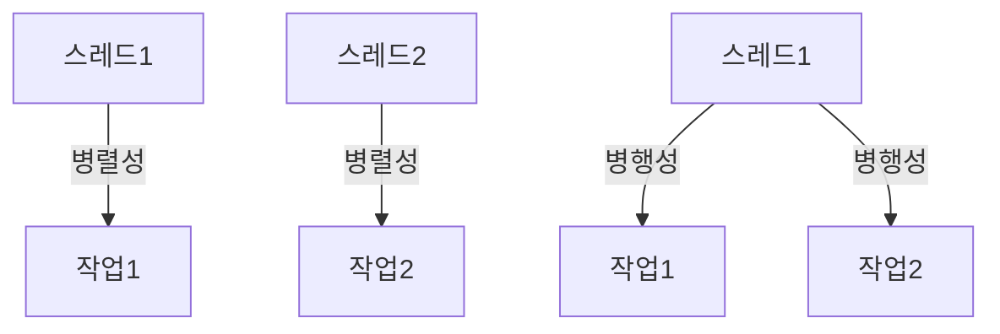

# Kotlin Coroutine_1 (코루틴 기본 개념 1)

- 코루틴(Coroutine)은 Kotlin 에서 비동기 프로그래밍을 위한 경량 스레드.
- 코루틴은 스레드보다 훨씬 가볍고, 스레드의 오버헤드가 적어 효율적인 비동기 작업을 수행할 수 있다.
- `비선점적 멀티태스킹` 방식이다.
> - 일반적으로 병렬작업시, 작업 중단되면(sleep, wait) 해당 Thread 는 다른 작업을 수행하지 못하고 Block(대기) 된다. -> 자원 낭비
> - `코루틴` 은 비선점 방식, 즉 작업 중단되면 다른 코루틴이 실행될 수 있도록 하여, 자원을 효율적으로 사용한다.
>> 즉 `실행의 지연과 재개` 를 허용하여, 비동기 작업을 효율적으로 처리할 수 있다.
- 코루틴은 `경량 스레드`로, 스레드보다 훨씬 적은 메모리를 사용하고, 스레드의 오버헤드가 적다.
  - `Thread`: 
    - OS Level 관리
    - 수 MB ~ 수십 MB 메모리 사용(무거움)
    - 블로킹시 Thread 점유
  - `Coroutine`: 
    - JVM Level 관리
    - 수 KB 메모리 사용(가벼움)
    - 수 천개 이상의 코루틴 생성 & 실행 가능
      - 10,000 개 코루틴 생성/실행 -> 실제 Thread 4~8 개 정도만 사용하여 `병행처리`
    - 블로킹시 다른 코루틴 실행 가능
<br><br>
  - 코루틴은 `항상 Thread 위`에서 실행된다. 그리고 Dispatcher 에 따라 Thread 를 Context Switch 하여 실행되기도 한다.
    - 즉, suspend 되었다가, 재개 될때 다른 Thread 에서 실행될 수 있다.
      - 일반적으로 Thread 는 OS 가 Context Switch 하지만 -> 비용큼 무거움
      - 코루틴은 JVM Level 에서 Context Switch(상태 저장) 하여, `비용이 적고 가볍고 빠르다.`
    - Dispatcher 에 따라 코루틴이 실행되는 Thread 를 지정할 수 있다.
      - `Dispatchers.Default`: CPU 코어 수에 따라 자동으로 Thread 수 조정 (일반적으로 Core * 2)
      - `Dispatchers.IO`: I/O 작업에 최적화된 Thread Pool (네트워크, 파일 I/O 등)
      - `Dispatchers.Main`: UI 스레드에서 실행(안드로이드, JavaFX 등)
      - `Dispatchers.Unconfined`: 현재 스레드에서 실행, suspend 되면 다른 스레드에서 재개
> #### Dispatcher
> - 코루틴이 실행되는 스레드를 지정하는 역할.(코루틴의 경량스레드를 관리)
>   - 일반적으로 기본 디스패처를 사용하는 경우가 많지만, 경우에 따라 커스텀하여 사용 할 수 있음.
>     - 제한된 Thread Pool 사용.
>     - Debugging, Logging, Monitoring 을 위한 Thread Name 지정
>     - 특정 우선순위, 정책을 가진 Thread 에서만 실행하고 싶을때
>     - Spring + 코루틴환경 에서 IO Thread Pool 과 분리하여 사용하고 싶을때

---

- `결과가 필요`한 작업일 경우
  - await / async 를 사용하여 코루틴의 Return 값을 받을 수 있다.(계산 결과, API 호출 결과 등)
    - API 2개를 호출하여 결과를 합치는 경우 -> 
      - `async` 를 사용하여 두 API 호출을 동시에 실행하고, `await` 를 사용하여 결과를 기다린후 -> 다른 작업을 진행할 수 있음(DTO 에 합치기 등)
> 일반적으로 결과가 필요없는 경우, `launch` 만 사용하면 된다!(로그 저장, 푸시 발송)
```kotlin
fun main() = runBlocking {
    val result = coroutineScope { // 코루틴 자식 스코프 생성: 모든 자식 코루틴이 끝날때까지 대기함, 하나라도 실패시 전체 취소(실패)
        val dataFromApi1 = async { fetchDataFromApi1WithError() } // API 1 호출
        val dataFromApi2 = async { fetchDataFromApi2() } // API 2 호출

        mergeData(dataFromApi1.await(), dataFromApi2.await())  // 데이터병합(예외 발생 시 이 지점에서 멈춤)
    }
}
```
- async 의 경우 `Deferred<T>` 타입을 반환함. 결과는 `.await()` 메서드로 가져올 수 있음.
  - `Deferred<T>` 는 `Job` 을 상속받아, `await()` 메서드를 제공함.
    - `await()` 는 suspend 함수로, 결과가 준비될 때까지 대기하고, 결과를 반환함.
    - `Deferred` 는 `Job` 이므로, `cancel()` 메서드를 호출하여 취소할 수 있다.


---

### 병렬성(Parallelism) VS 병행성(Concurrency)

- **병렬성(Parallelism)**: 여러 작업을 동시에 수행하는 것.
  - 예: 멀티코어 CPU에서 여러 스레드가 동시에 실행되는 경우.
<br><br>
- **병행성(Concurrency)**: 여러 작업이 동시에 진행되는 것처럼 보이지만, 실제로는 하나의 스레드에서 순차적으로 실행되는 경우.
  - 예: 싱글 스레드에서 여러 작업이 번갈아 가며 실행되는 경우.
  - `동시성` 이라고도 한다.



<br><br>
- 코루틴에서는 `병렬성`과 `병행성` 모두 지원한다.
- 다만 코루틴은 기본적으로 `병행성`을 지원하며, `병렬성`을 구현하려면 `Dispatchers.Default` 또는 `Dispatchers.IO` 등을 사용하여 여러 코루틴을 동시에 실행할 수 있다.
  - 코루틴은 비동기 작업(API 호출, DB 조회, 파일 I/O 등) 에 특화되어 있음 => `스레드 낭비` 없이 동시에 많은 요청을 처리할 수 있도록 설계됨 (`대부분 병행성` 문제에 해당)
    - `병렬성`을 사용해야할때는 ? (CPU 집약적인 작업(연산많을때), 이미지처리, 영상 인코딩, 대규모 계산)
> 즉, 작업을 동시에 처리하는 듯한 착시를 줘서 응답 성능을 높이는 것이 목적이다.(병행성)

- `runBlocking` 내부에서 실행되는 각각의 `launch` 내부에 `중단지점(suspend)` 가 존재 하지 않는다면,
  - 병렬+병행성은 의미가 없다. 
  - 중단 지점이 없기 때문에, 순차적으로 실행하게 되며 코루틴간의 `양보 + 스케줄링(컨텍스트 스위치)` 가 발생하지 않기때문에 일반 코드처럼 동작한다. 

---
### 코루틴 생명주기 & Cancel
- 코루틴은 `코루틴 빌더`를 사용하여 생성되며, `코루틴 스코프` 내에서 실행된다.
- 코루틴은 `실행된 프로세스` 가 살아있을때만, 실행된다.
  - 만약 task1 이 Main Thread 가 아닌 다른 Thread 에서 실행되고 있다면, Main Thread 가 종료되면 task1 은 실행되지 않는다.
- 다만 `dispatcher.default` 에서 실행중이고 suspend 즉 중단지점 (delay 같은) 지점이 없다면?(ex. 무한루프) 일 경우
  - Main Thread 에서 `cancel()` 을 호출해도, 계속 실행된다.
  - 즉 `cancel` 을 위해서는 suspend 지점이 있어야 한다.(delay, isActive 등)
- `corutines.example_3_job` 예제 참고!
   

---

## Tips! 
- 코루틴을 `디버깅`하고 싶을때 VM Option 을 활용하여 코루틴 상태 확인가능(어떤 코루틴에서 실행됬는지?)
  - `-Dkotlinx.coroutines.debug` 옵션을 추가하여 코루틴 디버깅 활성화


